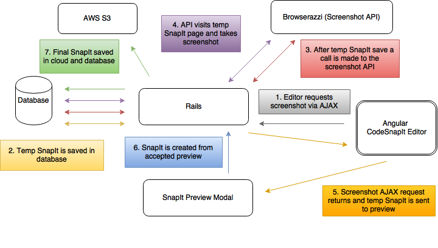

#  CodeSnapIt 

Share snap shots of your beautiful code! See the live application [here](http://codesnapit.herokuapp.com/activities)!

## Overview

CodeSnapIt was inspired by the inability to share syntax-highlighted code across social media without taking screenshots and jumping through hoops. Currently, CodeSnapIt is a fully self-contained social media site for sharing code, commenting and liking on that code, and following users.

### The Lifecycle of a SnapIt

SnapIt creation involves communicating with a separate application [Browserazzi](https://github.com/BideoWego/browserazzi/) built with Node.js. SnapIt creation can be broken down into these steps:

1. Editor requests screenshot via AJAX
2. Temp SnapIt is saved in the database
3. After temp SnapIt save a call is mode to the screenshot API
4. API visits temp SnapIt page and takes screenshot
5. Screenshot AJAX request returns and temp SnapIt is sent to preview
6. SnapIt is created from accepted preview
7. Final SnapIt saved in cloud and database

### Other Notable Tech

Some of the more interesting parts of the project included:

- Tagging using [At.js](http://ichord.github.io/At.js/)
- [Searchable concern](https://github.com/BideoWego/codesnapit/blob/master/app/models/concerns/searchable.rb) to share across multiple models
- Using Gravatar as a [profile image](https://github.com/BideoWego/codesnapit/blob/master/app/models/profile.rb) option
- Custom controller methods for [Devise](https://github.com/plataformatec/devise)
- [Slugified](https://github.com/Slicertje/Slugify) user profile links

## Team

CodeSnapIt was the final [Viking Code School](https://www.vikingcodeschool.com/) project for [Chris Scavello](https://github.com/BideoWego) ([blog](http://bideowego.com)) and [Justin Mullis](https://github.com/nonadmin) ([blog](http://nightiron.com/)) who were the primary authors. [Sia Karamalegos](https://github.com/siakaramalegos) ([portfolio](http://siakaramalegos.github.io/)), another Viking student, contributed on a smaller scale to experience Agile development on a small team.
